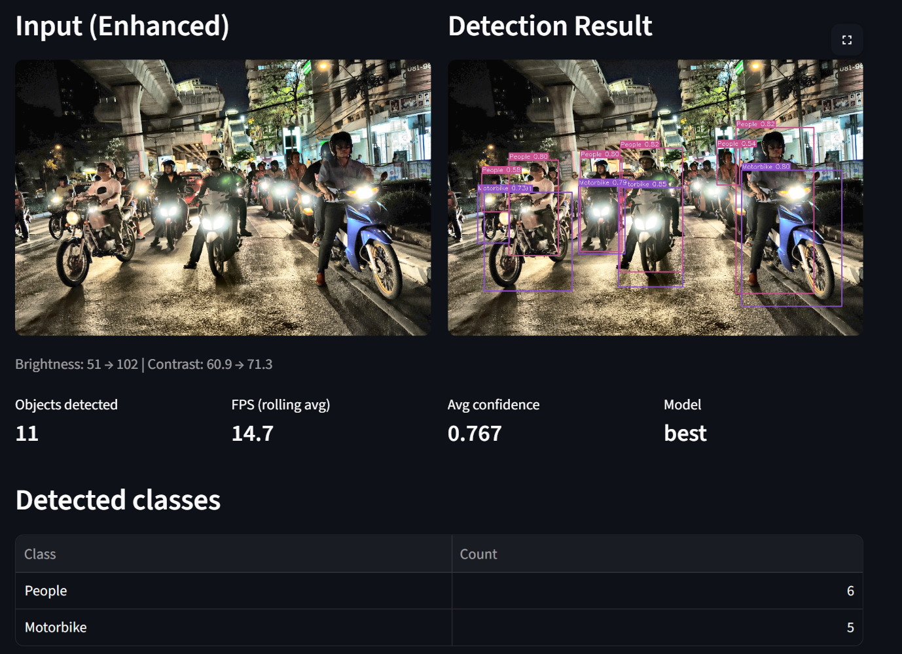
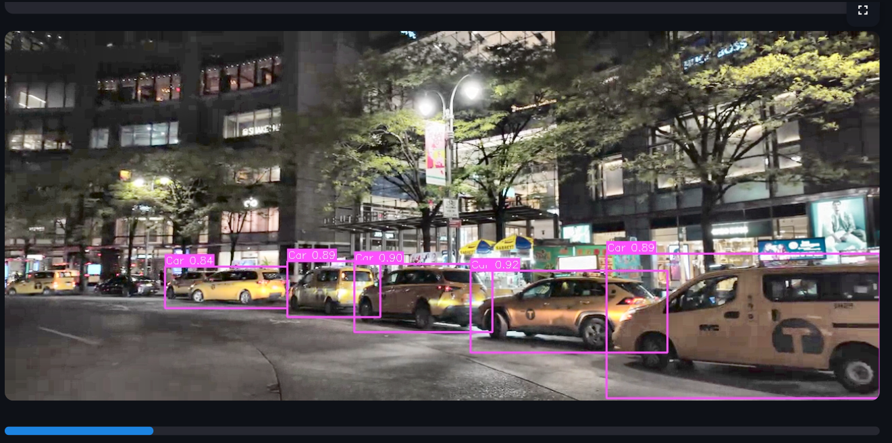
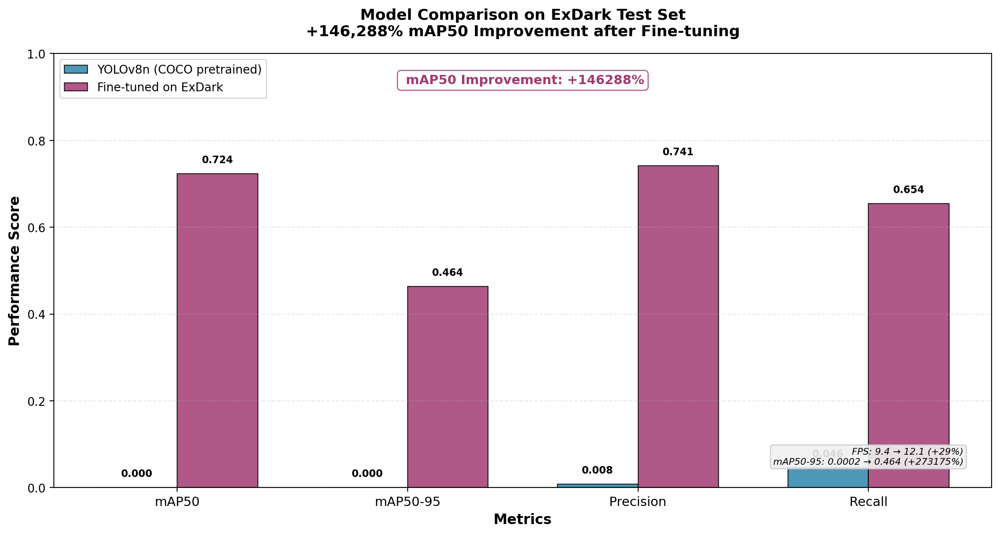
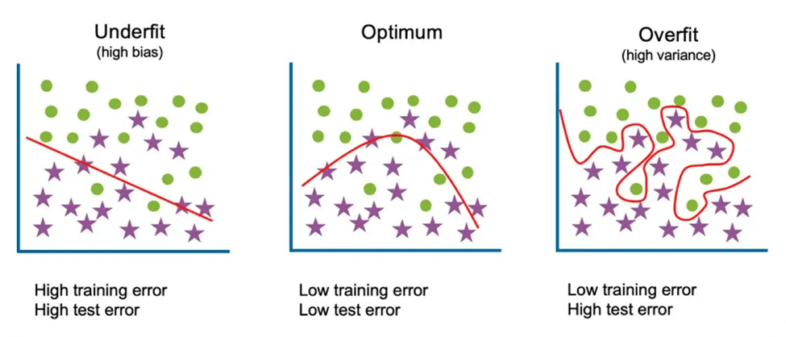
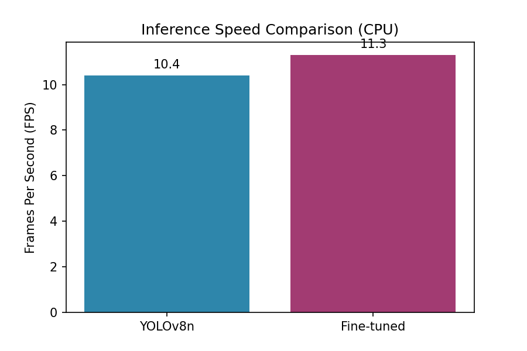
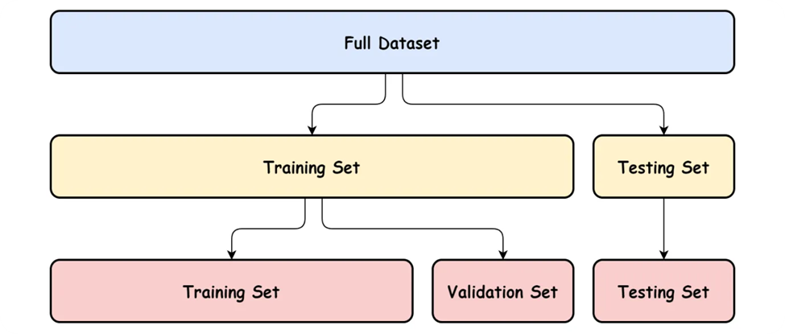

<div align="center">
  

  <h1 align="center">Low-Light AI Surveillance Dashboard</h1>

  <p align="center">
    <strong>Advanced Real-Time Object Detection for Extreme Low-Light Environments</strong>
    <br/>
    <em>COMSATS University Islamabad — Computer Vision Lab Final Project (SP2026)</em>
  </p>

  <p align="center">
    
    
    
    
  </p>
</div>

<br/>

> [!NOTE]
> **The "Domain Gap" Challenge:** Standard object detectors trained on well-lit datasets (like MS COCO) suffer massive performance degradation in dark environments. This project bridges that gap by combining **domain-specific fine-tuning** (transfer learning on the ExDark dataset) with **dynamic OpenCV enhancement pipelines**, resulting in an extremely robust night-vision surveillance system.

<div align="center">
  
</div>

##  Key Capabilities

| Feature | Description |
| :--- | :--- |
|  **Real-Time Processing** | Achieve `>15 FPS` on standard CPUs and `~30 FPS` on GPUs via optimized YOLOv8 architectures. Analyze images, videos, or live webcams instantly. |
|  **Domain Adaptation** | Fine-tuned specifically on the [ExDark Dataset](https://github.com/cs-chan/Exclusively-Dark-Image-Dataset) to perfectly understand dark pixel distributions. |
|  **Dynamic Enhancement** | Implements automated **CLAHE** (Contrast Limited Adaptive Histogram Equalization) and **Gamma Correction** via LAB color space to recover shadow details without amplifying noise. |
|  **Adversarial Simulation** | Built-in Albumentations pipeline simulating severe low-light conditions (`RandomGamma` + `GaussNoise`) to test system robustness dynamically. |
|  **Advanced Telemetry** | Professional Streamlit interface featuring live FPS trackers, frame confidence analytics, and dynamically updating class distribution charts. |

---

##  Interface Previews

Our premium dashboard is designed for high-visibility monitoring, utilizing a sleek, high-contrast dark theme optimized for control rooms.

<div align="center">
  
</div>

> [!TIP]
> The **Live Telemetry** panel tracks rolling FPS and average frame confidence, allowing security personnel to monitor the reliability of the AI detections in real-time.

---

##  System Architecture

This solution seamlessly integrates three major computer vision frameworks to achieve state-of-the-art results:

1. **Framework 1: Ultralytics (YOLOv8)** — The core inference engine. We utilize transfer learning to adapt YOLOv8's feature extractors to recognize the 12 specific classes of the ExDark dataset under extreme occlusion and noise.
2. **Framework 2: OpenCV (Preprocessing)** — Powers the image enhancement module, applying logarithmic luminance shifts *before* the frame reaches the YOLO network, artificially boosting detection confidence.
3. **Framework 3: Albumentations (Validation)** — Drives the low-light severity simulation, allowing us to validate the model's resilience against varying degrees of darkness.

<div align="center">
  
</div>

---

##  Data & Performance Analytics

Our evaluation framework provides in-depth metrics and visualizations, directly accessible from the dashboard's analytics tab.

<div align="center">
  
  
</div>
<br/>
<div align="center">
  
</div>

---

##  Getting Started

### Prerequisites

*   Python 3.10 or 3.11 (strictly required for Ultralytics/Streamlit compatibility)
*   A machine with a dedicated GPU is recommended for fine-tuning, but the dashboard operates smoothly on CPU-only edge devices.

### 1. Installation

Clone the repository and prepare your virtual environment:

```bash
git clone https://github.com/NoumanZahid-85/AI-Surveillance-with-Low-Light-Object-Detection.git
cd AI-Surveillance-with-Low-Light-Object-Detection

# Create a virtual environment
python -m venv venv
```

**For Windows Users:**
```powershell
# Activate the environment
.\venv\Scripts\activate
# Install all required dependencies
pip install -r requirements.txt
```

**For Mac/Linux Users:**
```bash
# Activate the environment
source venv/bin/activate
# Install all required dependencies
pip install -r requirements.txt
```

### 2. Dataset Setup (ExDark)

> [!IMPORTANT]
> To reproduce the training or run the evaluation pipeline, you must download the ExDark dataset.

1. Download the dataset from the [official repository](https://github.com/cs-chan/Exclusively-Dark-Image-Dataset) (~1.5 GB).
2. Place the `ExDark` and `ExDark_Annno` folders inside the `data/ExDark/` directory.
3. Run the format conversion and splitting scripts:

```bash
python scripts/convert_annotations.py
python scripts/split_dataset.py
```

### 3. Model Deployment

Place your fine-tuned checkpoint (`best.pt`) exported from your Kaggle training run into the `models/` directory. If you do not have it, the system will fall back to the standard `yolov8n.pt` for benchmarking.

---

##  Usage & Evaluation

### Launch the Dashboard

Fire up the interactive Streamlit application:

```bash
streamlit run app.py
```

The application will automatically open in your default browser at `http://localhost:8501`. Navigate via the completely redesigned sidebar to access Real-Time Detection, Analytics, and Model Comparisons.

### Generate Analytics

To populate the dashboard's "Analytics & Results" tab with actual metrics comparing the baseline model against the fine-tuned model, run the evaluation script:

```bash
python scripts/run_eval.py
```

> [!NOTE]
> This script calculates the exact percentage improvements in mAP, Precision, Recall, and the specific confidence gains achieved via the OpenCV CLAHE enhancement pipeline.
